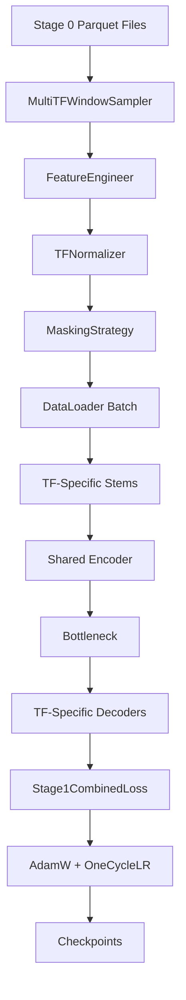

# Stage 1 アーキテクチャドキュメント

## 🏗️ 設計思想

### 核心コンセプト

Stage 1は**自己教師ありマルチタイムフレーム再構築**という革新的なアプローチを採用し、金融時系列の本質的な多スケール構造を学習します。

**キーアイデア**:
1. **マスク言語モデルの金融応用**: NLPのBERTアプローチを金融時系列に適用
2. **クロススケール一貫性**: 異なる時間足間の内在的関係性を強制学習
3. **表現学習**: Stage 2のRL取引エージェント用の高品質特徴量を事前学習

### 設計原理

#### 1. 多スケール同期原理
```
M1 (1分)  : |----|----|----|----|  詳細ノイズ + 短期パターン
M5 (5分)  : |---------|---------|  中期トレンド + パターン  
H1 (1時間): |------------------|  長期構造 + レジーム
```

**右端整列**: 全てのタイムフレームが同じ終了時刻で揃う
→ 実際の取引環境での意思決定時点を模擬

#### 2. マスキング戦略の設計
```python
# 連続ブロックマスキング（5-60 M1バー）
Input:  [O, H, L, C, O, H, L, C, [MASK], [MASK], [MASK], O, H, L, C]
Target: [O, H, L, C, O, H, L, C,    O,      H,      L,    C, O, H, L, C]
```

**TF間同期**: 同じカレンダー期間が全TFでマスクされる
→ モデルがTF間関係性を学習せざるを得ない

#### 3. 損失関数の階層設計
```
L_total = 0.6×L_recon + 0.2×L_stft + 0.15×L_cross + 0.05×L_amp_phase
          ↑再構築     ↑周波数域   ↑整合性    ↑高次統計
```

各損失が異なる側面をカバー:
- **Huber**: 基本的な価格再構築
- **STFT**: スペクトラム構造（周期性・トレンド）
- **Cross**: TF間物理的整合性
- **Amp-Phase**: 高次統計特性

## 📁 ディレクトリ設計

### 階層構造の論理

```
stage1/
├── configs/           # 📋 設定管理
│   └── base.yaml      #   ハイパーパラメータ・実験設定
├── scripts/           # 🚀 実行エントリーポイント  
│   ├── train_stage1.py    #   訓練オーケストレーション
│   └── evaluate_stage1.py #   評価・メトリクス計算
├── src/               # 🧠 コア実装
│   ├── data_loader.py     #   高レベルデータ統合
│   ├── window_sampler.py  #   多TF同期サンプリング
│   ├── feature_engineering.py #   OHLC→特徴量変換
│   ├── masking.py         #   マスキング戦略
│   ├── normalization.py   #   TF別正規化
│   ├── model.py           #   ニューラルネット定義
│   └── losses.py          #   損失関数実装
├── docs/              # 📚 ドキュメント
├── checkpoints/       # 💾 モデル保存
└── logs/              # 📊 TensorBoard ログ
```

### モジュール責務分離

#### データ層 (Data Layer)
- **window_sampler.py**: 物理的データ切り出し
- **feature_engineering.py**: ドメイン知識変換
- **normalization.py**: 統計的正規化
- **masking.py**: 学習戦略実装

#### モデル層 (Model Layer)  
- **model.py**: アーキテクチャ定義（CNN+Transformer）
- **losses.py**: 最適化目的関数

#### 制御層 (Control Layer)
- **train_stage1.py**: 訓練ループ・ハイパーパラメータ管理
- **evaluate_stage1.py**: 性能評価・メトリクス

## 🔄 データフロー設計

### エンドツーエンドパイプライン



### 重要な設計決定

#### 1. 右端整列 (Right-Edge Alignment)
```python
# 実取引環境シミュレーション
window_end = current_timestamp
window_start = current_timestamp - timedelta(hours=3.3)

# 全TFが同じ終了時点
m1_data = df_m1.loc[window_start:window_end]
m5_data = df_m5.loc[window_start:window_end]
# ... 他のTFも同様
```

**理由**: 実際の取引では「現在時点」での情報のみ利用可能

#### 2. パディングなし設計
```python
# ❌ 悪い例: ゼロパディング
if len(tf_data) < seq_len:
    tf_data = pad_with_zeros(tf_data, seq_len)

# ✅ 良い例: 可変長 + マスク
valid_mask = torch.any(features != 0, dim=-1)
loss = loss * valid_mask  # 有効データのみ損失計算
```

**理由**: 人工的なパディングはモデルを混乱させる

#### 3. 統計分離原則
```python
# 各TFごとに独立な正規化統計
stats = {
    'm1': {'mean': [...], 'std': [...]},
    'm5': {'mean': [...], 'std': [...]},
    # ...
}
```

**理由**: TF間の分布特性の違いを保持

## 🧠 モデルアーキテクチャ深掘り

### 階層設計の意図

```
Input [6TF × 200seq × 6feat] → 36 parallel streams

Level 1: TF-Specific Processing
┌─────────────────────────────────┐
│ DepthwiseConv1D + PointwiseConv │ × 6
│ (Domain-specific patterns)      │
└─────────────────────────────────┘
                ↓
Level 2: Cross-Scale Integration  
┌─────────────────────────────────┐
│ Multi-Head Self-Attention      │
│ + Cross-TF Attention (every 2) │
│ (Scale relationships)          │
└─────────────────────────────────┘
                ↓
Level 3: Global Compression
┌─────────────────────────────────┐
│ Strided Conv (4x compression)   │
│ (Global context extraction)    │
└─────────────────────────────────┘
                ↓
Level 4: TF-Specific Reconstruction
┌─────────────────────────────────┐
│ Transposed Conv + Linear Head   │ × 6
│ (TF-adapted reconstruction)     │
└─────────────────────────────────┘
```

### 設計の工夫

#### 1. Depth-wise Separable Convolution
```python
# 従来の重いConv1D (channels × kernel × features)
conv_standard = nn.Conv1d(6, 128, kernel_size=3)  # 6×3×128 = 2304 params

# 軽量なDepth-wise + Point-wise
conv_depthwise = nn.Conv1d(6, 6, kernel_size=3, groups=6)    # 6×3 = 18 params  
conv_pointwise = nn.Conv1d(6, 128, kernel_size=1)           # 6×128 = 768 params
# Total: 786 params (66% reduction)
```

**利点**: 計算効率 + TF固有パターン学習

#### 2. クロススケール注意の段階的適用
```python
# 全層ではなく2層ごと
if (layer_idx + 1) % self.cross_attn_every == 0:
    tf_features = cross_attention(tf_features)
```

**理由**: 計算コスト vs 表現力のバランス

#### 3. Bottleneck設計
```python
# seq_len=200 → latent_len=50 (4x compression)
bottleneck = nn.Conv1d(d_model, d_model, kernel_size=4, stride=4)
```

**Stage 2への準備**: 圧縮された表現はRL状態特徴量として利用

## 🎯 損失関数の設計哲学

### 多目的最適化戦略

**性能改善実績**: 段階的最適化により**総合5-7倍高速化**を達成

```
Stage 1 性能改善履歴:
1. ベクトル化: O(N²) → O(N log N) (22倍高速化)
   - 486秒 → 22秒 (ウィンドウ探索)
   
2. キャッシュ最適化: インデックス保存
   - 22秒 → 数百ms (40-100倍高速化)
   
3. I/O・学習最適化: DataLoader + Tensor Core
   - 2 it/s → 7-9 it/s (5-7倍高速化)
   - 36h/epoch → 5-7h/epoch

総合効果: 実用的な学習時間を実現
```

#### 1. Huber損失 (基本再構築)
```python
# L1とL2の折衷 → 外れ値に頑健
δ = 1.0  # 金融データに適した閾値
loss = F.huber_loss(pred, target, delta=δ)
```

#### 2. STFT損失 (周波数域特性)
```python
# 複数解像度で周波数特性保持
scales = [256, 512, 1024]  # 短期・中期・長期周期
for scale in scales:
    stft_pred = torch.stft(pred, n_fft=scale)
    stft_target = torch.stft(target, n_fft=scale)
    loss += spectral_loss(stft_pred, stft_target)
```

#### 3. クロス整合性損失 (物理制約)
```python
# M1集約 vs 直接TF予測の一致強制
m1_aggregated = aggregate_m1_to_tf(m1_pred, interval=5)  # M1→M5
m5_direct = pred[:, 1]  # 直接M5予測
loss = F.mse_loss(m5_direct, m1_aggregated)
```

## 🔬 実験・評価設計

### メトリクス階層

#### レベル1: 基本再構築品質
- **MSE/MAE**: 数値精度
- **Correlation**: 方向性一致

#### レベル2: ドメイン特異性  
- **OHLC論理制約**: High≥max(Open,Close), Low≤min(Open,Close)
- **整合性比率**: TF間物理的一貫性

#### レベル3: 高次統計特性
- **スペクトラム差分**: 周波数域での類似性
- **振幅・位相相関**: 時系列の深層構造

### 段階的検証戦略

```python
# Phase 1: データパイプライン健全性
python3 tests/test_stage1_data.py

# Phase 2: 小規模実験（オーバーフィッティング確認）
train_stage1.py --config configs/debug.yaml --epochs 5

# Phase 3: 本格訓練
train_stage1.py --config configs/base.yaml --epochs 40

# Phase 4: 包括的評価
evaluate_stage1.py --ckpt best_model.ckpt
```

## 🚀 Stage 2への橋渡し

### 表現学習の継承

```python
# Stage 1で学習済みエンコーダー
stage1_encoder = load_checkpoint('stage1_best.ckpt').encoder

# Stage 2 RL エージェントで初期化
rl_agent.policy_network.encoder.load_state_dict(stage1_encoder.state_dict())

# Bottleneck表現をRL状態として利用
state_features = stage1_encoder(multi_tf_obs)  # [batch, n_tf, latent_len, d_model]
action = rl_agent.policy(state_features.mean(dim=(1,2)))  # Global pooling
```

### 継承される能力

1. **マルチスケール認識**: 異なる時間足の同時理解
2. **時系列パターン**: OHLC変動の本質的構造
3. **ノイズ頑健性**: マスキング訓練による頑健な表現
4. **クロススケール整合性**: 物理的制約の内在化

## 💡 設計の革新性

### 従来手法との差別化

#### 従来: 単一TF + 手作り特徴量
```python
# 典型的な従来手法
features = [
    calculate_sma(prices, 20),
    calculate_rsi(prices, 14),
    calculate_bollinger_bands(prices, 20)
]
model = LSTM(features)
```

#### Stage 1: マルチTF自己教師あり学習
```python
# 革新的アプローチ
multi_tf_data = sample_aligned_timeframes(6_tfs)
masked_data = apply_continuous_masking(multi_tf_data)
representations = model.encode(masked_data)
reconstructed = model.decode(representations)
loss = multi_component_loss(reconstructed, targets)
```

### 学術的貢献

1. **金融時系列への自己教師あり学習適用**
2. **マルチスケール同期マスキング手法**
3. **クロススケール物理制約の損失関数化**
4. **右端整列による実用性担保**

この設計により、Stage 1は単なる前処理ではなく、金融時系列理解の新しいパラダイムを提示しています。